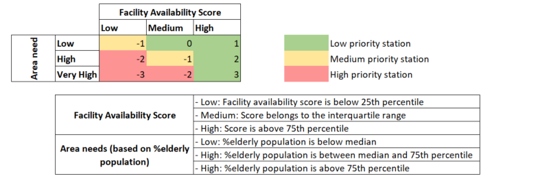

# About the project

This project generates an Accessibility Index to evaluate how well MTR stations serve elderly and disabled populations across Hong Kong. By analyzing the availability of barrier-free facilities against district-level demographic needs, the index aims to:

- Identifies priority stations requiring urgent accessibility upgrades
- Highlights facility gaps
- Guides equitable urban planning to align infrastructure with community needs

# Data overview

All data sourced from [Hong Kong Open Data](https://data.gov.hk/).

| Category | Source | Dataset |
|----------|--------|---------------|
|MTR barrier-free facilities| [CSV](https://data.gov.hk/en-data/dataset/mtr-data-routes-fares-barrier-free-facilities) | (1) Free-barrier facilities available at each MTR station; (2) Barrier-free facility details; (3) MTR station details |
|2021 Population census data| [API](https://data.gov.hk/en-data/dataset/hk-censtatd-census_geo-2021-population-census-by-dcd/resource/dd44d37e-85c7-49b7-b485-644db561cf80) | Hong Kong population by age group and district |
|GeoCommunity database | [CSV](https://data.gov.hk/en-data/dataset/hk-landsd-openmap-development-hkms-digital-geocom) | MTR station location |

# Methodology

**Accessibility index**
1. Facility availability scoring: Weighted points for each facilities based on criticality
2. Area need adjustment scoring: Adjusted points based on facility availability score and %elderly population. Points are adjusted based on the framework below.

**Station prioritization**

## TBD
- Project writeup
- Incorporate geospatial data on bus stops to assess bus connectivity