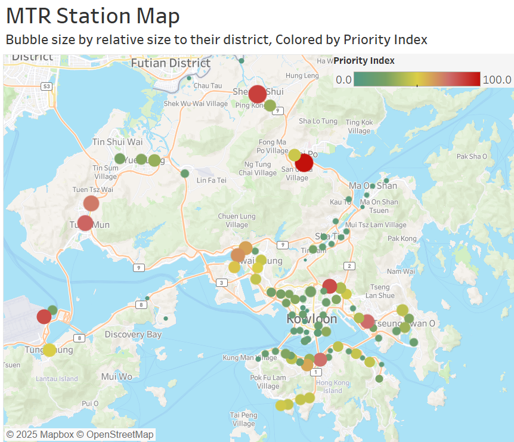
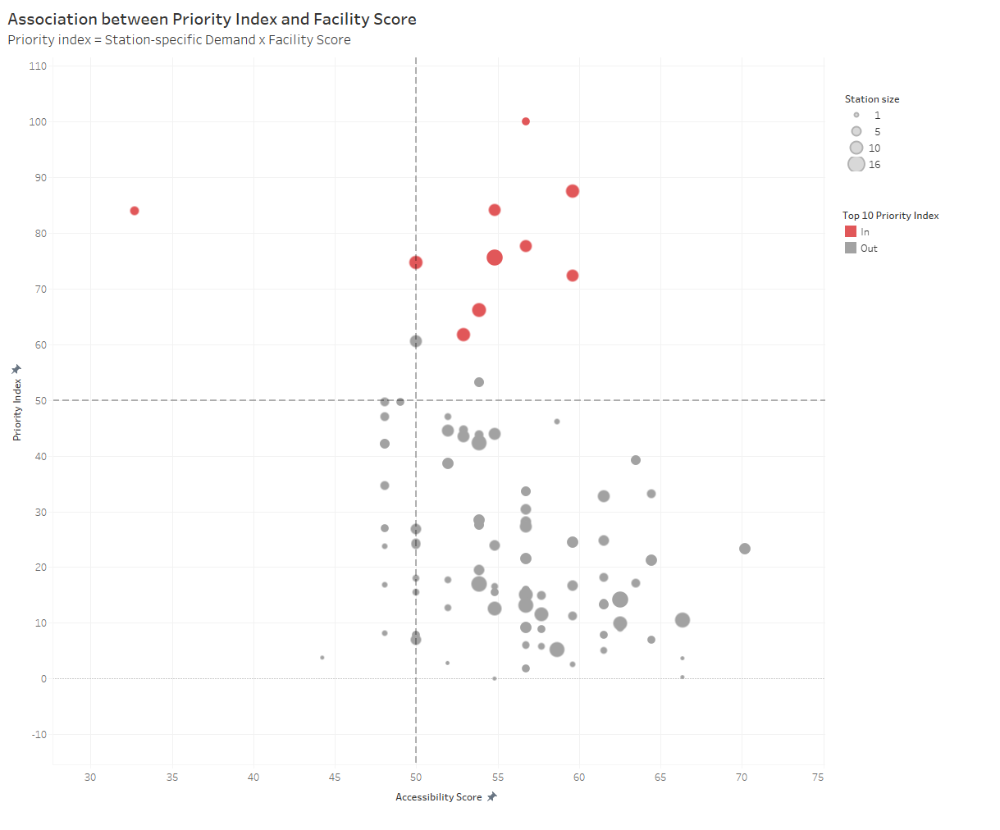
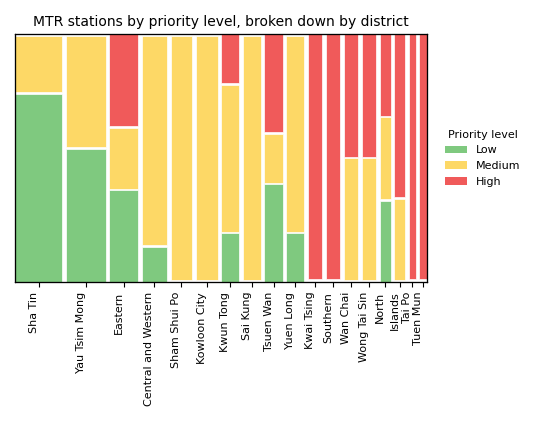

# About the project

*add what inspired the project*

This project generates an Accessibility Index to evaluate how well MTR stations serve elderly and disabled populations across Hong Kong. By analyzing the availability of barrier-free facilities against district-level demographic needs, the index aims to:

- Identifies priority stations requiring urgent accessibility upgrades
- Highlights facility gaps
- Guides equitable urban planning to align infrastructure with community needs

# Executive summary

*add summary*

# Data overview

## Data collection

All data sourced from [Hong Kong Open Data](https://data.gov.hk/).

| Category | Format | Dataset |
|----------|--------|---------------|
|MTR barrier-free facilities| [CSV](https://data.gov.hk/en-data/dataset/mtr-data-routes-fares-barrier-free-facilities) | (1) Free-barrier facilities available at each MTR station; (2) Barrier-free facility details; (3) MTR station details |
|2021 Population census data| [API](https://data.gov.hk/en-data/dataset/hk-censtatd-census_geo-2021-population-census-by-dcd/resource/dd44d37e-85c7-49b7-b485-644db561cf80) | Hong Kong population by age group and district |
|Geospatial data | [CSV](https://data.gov.hk/en-data/dataset/hk-landsd-openmap-development-hkms-digital-geocom) | MTR station and exit locations|

## Data structure

*add images of data structure*

# Methodology

# Key findings

## 1. Stations with high priority for accessibility upgrades tend to be the bigger ones within their districts.

- Red points coincide with the bigger bubble, indicating that those with high priority index are the bigger stations in their districts.
- No concentration of high priority stations in one district.
- Implication: A quick way to start improving accessibility is to focus on the bigger stations within each district.

## 2. High priority stations does not necessarily mean they have the least accessibility facility.

- Facility score represents the availability of accessibility facilities at each station, with higher score indicating higher availability.
- There is not a big difference in facility score across stations, indicating that MTR stations are evenly accessible, except for one outlier with significantly lower facility score, which is MTR Airport.
- However, differences exist across stations' priority index because priority index takes into consideration the relative demand for the station within its district. This explains why some stations with high scores in facility availability are still in high priority group.

## 3. Stations with high priority index tend to be in more remote districts, with less MTR coverage.

- The width of the bar represents the number of stations in the district.
- Stations are categorized into three priority groups based on their priority index: if the priority index is within the 25% percentile, the station is in the low priority group; if the priority index is greater than the 75% percentile, the station is in the high priority group; otherwise, the station is in the medium priority group.
- Takeaway:
    - Stations in high priority group are concentrated among districts with less station coverage, i.e., Tai Po, Tuen Mun, Islands, Southern, Kwai Tsing.
    - Implication: More remote districts are less accessible, hence should be prioritized for accessibility upgrades.

## 4. System accessibility facilities lag behind other facilities in terms of availability.

- Across all priority groups, system accessibility facilities are the least available, followed by mobility impaired. While this suggests uniform accessibility across all facilities, the lack of system accessibility facilities are systematic.
- Implication: 

# Recommendations

# Limitations

## Priority index
- Priority index is based on the relative size of the station within its district, meaning the scattered distribution of high priority stations across the districts is inherent in the calculation. 
- Priority index is not a perfect indicator of accessibility, as it does not consider the quality of the facilities available at each station.

## Next steps
- Assessment of accessibility facilities' quality
- Incorporate geospatial data on bus stops to assess bus connectivity