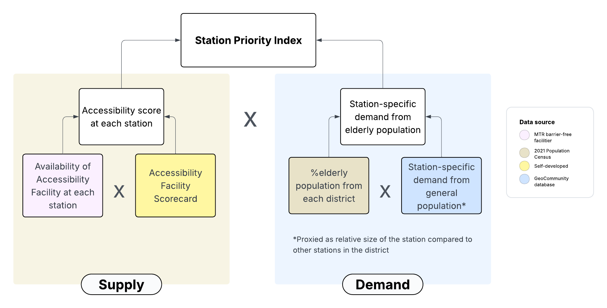
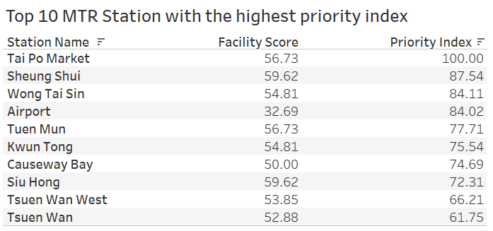
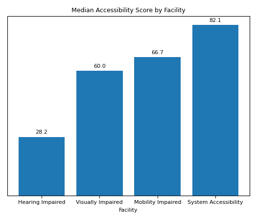

# About the project

This project evaluates how well MTR stations serve elderly and disabled populations across Hong Kong. By analyzing the availability of barrier-free facilities against district-level demographic needs, the index aims to:

- Identifies priority stations requiring urgent accessibility upgrades
- Highlights facility gaps
- Guides equitable urban planning to align infrastructure with community needs

# Executive summary

This project ranks Hong Kong MTR stations on the basis of their accessibility to elderly population, using a Priority index that blend elderly demands with each station's shortfall in accessibility facility availability. The analysis found that:

- High priority stations are typically the larger one within their districts. While no concentration of high priority stations in one district, the pattern skews to New Territories North/West and outlying areas.
- Facility availability is quite uniform across all stations, yet some stations need more urgent upgrades driven by higher demands from elderly population.
- System accessibility facilities are the bottleneck for MTR stations, with the least availability, hence, needs the most urgent upgrades.

Given these findings, improvement plan should prioritize upgrading bigger stations in each district, first focusing on the more remote areas to reduce mobility costs and passenger disruption, then expanding to the high priority stations in the central area. System accessibility facilities need utmost improvement priority, followed by mobility impaired facilities.

# Methodology

## Data collection

All data sourced from [Hong Kong Open Data](https://data.gov.hk/).

| Category | Format | Dataset |
|----------|--------|---------------|
|MTR barrier-free facilities| [CSV](https://data.gov.hk/en-data/dataset/mtr-data-routes-fares-barrier-free-facilities) | (1) Free-barrier facilities available at each MTR station; (2) Barrier-free facility details; (3) MTR station details |
|2021 Population census data| [API](https://data.gov.hk/en-data/dataset/hk-censtatd-census_geo-2021-population-census-by-dcd/resource/dd44d37e-85c7-49b7-b485-644db561cf80) | Hong Kong population by age group and district |
|GeoCommunity database | [CSV](https://data.gov.hk/en-data/dataset/hk-landsd-openmap-development-hkms-digital-geocom) | MTR station and exit locations|

## Data analysis methodology

  

The goal of this project is to generate a priority index that reflects the supply-demand gap between the current provision of accessibility facilities and the needs of local elderly people. Such index is derived from the following two components:

## Supply side: Accessibility score at each station 0 - 100

Data collection: The availability of barrier-free facilities at each station is collected, grouped into four categories: Hearing, Visual, Mobility, and System.

Develop a facility scorecard and accessibility score: Each facility has a point value reflecting its importance. A station’s accessibility score is the sum of points for available facilities in that category.

Comparison across stations: Accessibility scores are normalized to 0–100 using each category’s maximum possible points; the overall station score (0–100) summarizes provision across all categories.

Interpretation: Higher score = better accessibility provision at that station.

## Demand side: Station-specific demand from elderly population

This is a function of the amount of elderly population in each district, and their transportation demand for each station in each area/district (Station-specific demand), such that:

> Station-specific demand from elderly population = %Elderly population in each district * Station-specific demand from general population

Station-specific demand from general population is proxied by the size of the station, measured by the number of exits in each station. The underlying assumption is that the larger the station, the more people use it, and the more transportation demand it generates.

## Tech stack

- Data collection and processing: Python (API calls, pandas, geopandas, numpy)
- Data visualization: Python (matplotlib, geopandas), Tableau

# Key findings

## 1. Stations with high priority for accessibility upgrades tend to be the bigger ones within their districts.

  

- Warmer colours (higher priority index) often coincide with larger bubbles (bigger stations). This means high-priority sites are frequently the stations that carry a larger share of local trips.
- No concentration of high priority stations in one district.
- **Implication**: A pragmatic way to start is to tackle the biggest stations in each high-need district first; interventions there lift accessibility for the most riders.

## 2. Stations with high priority index tend to be in more remote districts, with less MTR coverage.

  

 
- Stations are categorized into three priority groups based on their priority index: if the priority index is within the 25% percentile, the station is in the low priority group; if the priority index is greater than the 75% percentile, the station is in the high priority group; otherwise, the station is in the medium priority group.
- Higher shares of high-priority stations are seen in Tai Po, Tuen Mun, Islands, Southern, and Kwai Tsing — districts with fewer stations and located further from the central area. No single district “owns” all the priority stations, but the pattern skews to New Territories North/West and outlying areas.
- **Implication**: Deliver upgrades by corridor/cluster (e.g., NT North, NT West, Kowloon East) to reduce mobilization costs and passenger disruption.

## 2. High priority stations does not necessarily mean they have the least accessibility facility.

  
  

- Facility score (0–100) is fairly tight across the network; most stations sit in the 50–60 range, with one clear under-performer being Airport (≈33). Many of the Top10 high-priority stations also sit around mid-range facility scores. 
- The reason why stations with mid-range facility scores are still in high priority group is because priority index also considers the station's relative demand within its district. Stations serving more riders and larger usage share (station size) can be high priority, even if their facilities are not the worst.
- **Implication**: Priority is not always on stations with the worst facility, but rather on those with a big supply-demand gap. 

## 4. System accessibility facilities lag behind other facilities in terms of availability.

  

- Across all priority groups, system accessibility facilities are the least available, followed by mobility impaired. While this suggests uniform accessibility across all facilities, the lack of system accessibility facilities are systematic.
- **Implication**: The fastest equity gains are likely to come from system accessibility fixes, i.e, redundant lifts/escalators, etc.

# Recommendations

- Prioritize improving high-priority stations in each district, especially those with high proportion of high-priority stations, such as Tai Po, Tuen Mun, Islands, Southern, and Kwai Tsing
- In terms of scope, prioritize system accessibility facilities, followed by mobility impaired. Hearing and visually impaired facilities can be upgraded on a case-by-case basis.
- Deliver improvements by geographical bundles, starting from the more remote districts, i.e, New Territories North, to lower unit costs amd minimize passenger disruption.

# Limitations

## Priority index
- Priority index is based on the relative size of the station within its district, meaning the scattered distribution of high priority stations across the districts is inherent in the calculation. 
- Priority index is not a perfect indicator of accessibility, as it does not consider the quality of the facilities available at each station.

## Accessibility scoring
- The scorecard used to assess the importance of each facility is based on elderly's needs. Therefore, the facility availability score might not be generalized to other population groups that need accessibility facilities such as disabled people. 

# Next steps
- Assessment of accessibility facilities' quality
- Incorporate geospatial data on bus stops to assess bus connectivity